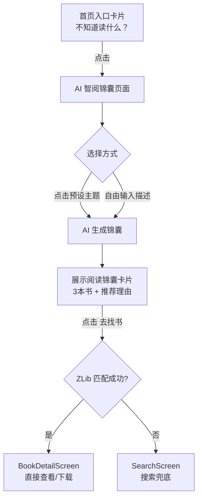

# AI 智阅锦囊 - 功能更新计划

> 日期：2026-02-12  
> 版本：v1.0.4 → v1.1.0

---

## 一、功能概述

新增 **"AI 智阅锦囊"** 功能：用户选择预设主题或自由输入当前状态/困惑，AI 生成个性化的 **阅读锦囊**（3本书推荐），并与现有 ZLibrary 搜索/下载能力深度结合，实现"选题 → 推荐 → 找书"一站式体验。

---

## 二、交互流程

---

## 三、预设主题

| 主题ID | Emoji | 中文标签 | 英文标签 |
|--------|-------|---------|---------|
| relax | 😮‍💨 | 工作压力大，想放松 | Stressed, need to unwind |
| direction | 🤔 | 感到迷茫，想找方向 | Feeling lost, seeking direction |
| learn | 📈 | 想系统学习某个领域 | Want to learn a new skill |
| bedtime | 💤 | 睡前想读点轻松的 | Light bedtime reading |
| heal | 💔 | 情感低落，需要治愈 | Emotionally down, need comfort |
| thinking | 🎯 | 想提升认知和思维 | Sharpen my thinking |

- 用户可 **点击主题**（快速）或 **自由输入**（灵活），两种方式走同一推荐逻辑
- 后续可动态扩展主题列表

---

## 四、UI 设计要点

### 4.1 首页入口
- 位置：搜索框下方、Trending 标签上方
- 样式：渐变背景小卡片（青色 → 深青色）
- 文案："不知道读什么？让 AI 帮你开锦囊 ✨"
- **非侵入式**：不改动现有搜索和导航

### 4.2 智阅锦囊页面
**输入区域:**
- 6个预设主题按钮（卡片式，带 Emoji）
- 分割线 "── 或者用自己的话描述 ──"
- 多行输入框 + "生成锦囊" 按钮

**结果展示 (锦囊卡片):**
- 拟物化设计：圆角卡片 + 顶部装饰条
- 标题："📜 你的专属阅读锦囊"
- 3本书依次展示：
  - 📖 书名 + 作者
  - 💡 推荐理由
  - `[去找书]` 按钮
- 底部"分享锦囊"按钮（适合截图分享）

---

## 五、技术方案

### 5.1 新增文件

| 层级 | 文件路径 | 说明 |
|------|---------|------|
| Model | `lib/models/prescription.dart` | `ReadingTip` + `ReadingBag` 数据模型 |
| Service | `lib/services/ai_service.dart` | `AiService` 抽象接口 + `MockAiService` |
| Provider | `lib/providers/prescriber_provider.dart` | Riverpod 状态管理 |
| Screen | `lib/screens/prescriber/prescriber_screen.dart` | 主页面 |

### 5.2 修改文件

| 文件 | 变更内容 |
|------|---------|
| `lib/routes/app_routes.dart` | 新增 `prescriber = '/prescriber'` |
| `lib/main.dart` | 注册路由 |
| `lib/screens/home/home_screen.dart` | 添加入口卡片 |
| `lib/l10n/app_localizations.dart` | 新增中英文本 |

### 5.3 兼容性保证
- ✅ 搜索模式完全不变（`SearchScreen` 零改动）
- ✅ 底部导航栏不变
- ✅ "去找书"复用现有 `ZLibraryApi.search()` + `BookDetailScreen`
- ✅ 使用项目现有技术栈：Riverpod、Dio、命名路由

### 5.4 AI 服务策略
- **当前阶段**：`MockAiService`，基于预设主题返回精选书单
- **后续阶段**：替换为 OpenAI / Gemini API，接收自由输入并动态推荐
- 接口设计已做抽象，切换零改动

---

## 六、验证清单

- [ ] 首页入口卡片正常显示，点击跳转正确
- [ ] 6个预设主题可点击，生成对应锦囊
- [ ] 自由输入模式可正常使用
- [ ] "去找书"按钮成功调用 ZLibrary 搜索
- [ ] 匹配成功跳转 BookDetailScreen
- [ ] 匹配失败优雅降级到 SearchScreen
- [ ] 原有搜索/收藏/下载功能完全不受影响
- [ ] 中英文国际化正常
